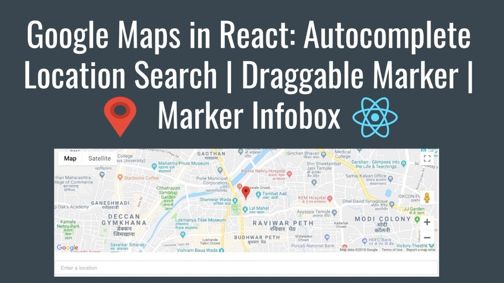

# Map-Using-React

## Description :clipboard:
> Demo App for Autocomplete Location Search, Draggable marker and Infobox using Google Maps API and React .



## Autocomplete Location Search Demo :video_camera:


## Use :point_right:

1. Get your API Key from [developers.google.com](https://developers.google.com/maps/documentation/javascript/get-api-key).
2. Add your Google Maps Key `./client/src/components/Map.js`

``` ruby
Geocode.setApiKey( "xxxxxxxxxx" );

```

## Installation Instructions :wrench:

1. Clone the repo using `git clone https://github.com/imranhsayed/google-maps-in-react`
2. `cd google-maps-in-react`
3. `npm install`
4. `cd client`
5. `npm install`
7. `cd ..`
8. `npm run dev`

## Built With :zap:

1. Node
2. Express
3. React
4. Create React App
5. Google Maps API
